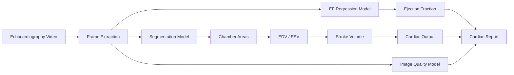

# Echo-Code
Multi-Task Deep Learning for Automated Cardiac Geometric Feature Extraction from Echocardiography

Author: Josh Thaosatien  
Stanford University — MATSCI 176 Final Project

## Overview

Echo-Code is a deep learning pipeline that produces an automated hemodynamic report from an echocardiographic video. The system integrates three models:

1. Four-chamber segmentation (Attention U-Net)
2. Ejection Fraction regression (ConvNeXt + Transformer)
3. Image quality grading (EfficientNet-B0)

The pipeline extracts cardiac geometry and hemodynamic metrics including:

- Ejection Fraction (EF)
- End-diastolic volume (EDV)
- End-systolic volume (ESV)
- Stroke Volume
- Cardiac Output
- Chamber areas
- Image quality grade

The project demonstrates how heterogeneous partially labeled datasets can be combined to build a unified cardiac analysis pipeline.

---

## System Pipeline


## Repository Structure

```
Echo-Code
├── main.py                 # Entry point for inference
├── requirements.txt        # Python dependencies
├── README.md

├── checkpoints/            # Trained models
├── weights/                # Pretrained backbone

├── scripts/                # Training scripts
│   ├── train_echo_seg.py
│   ├── train_ef.py
│   └── train_quality.py

├── src/                    # Core model code
│   ├── models/
│   ├── datasets/
│   ├── inference/
│   └── losses/
```

---

## Installation

Create a Python environment and install dependencies:
pip install -r requirements.txt

Core dependencies:
torch
torchvision
numpy
opencv-python
monai
albumentations
scikit-image
scikit-learn
matplotlib
tqdm

---

## Data

Due to GitHub storage limits, datasets and pretrained model checkpoints are hosted externally.

Google Drive:

https://drive.google.com/drive/folders/1mNYKmoGA0WOyQZ7atADTE1qTtkgYizRE

Download the folders:
datasets/
checkpoints/


Place them in the repository root:
```
Echo-Code/
├── data/
├── checkpoints/
```

### Datasets Used

| Dataset | Samples | Labels | Pipeline Role | Link |
|-------|-------|-------|-------|-------|
| **EchoNet-Dynamic** | 10,033 | EF, LV trace | EF regression (train + eval) | https://echonet.github.io/dynamic/ |
| **CAMUS** | 7,500 | LV, LA | Segmentation (left-side only) | https://www.kaggle.com/datasets/shoybhasan/camus-human-heart-data/data |
| **CardiacUDA** | 9,680 | All 4 Chambers | Segmentation (G = source, R = held-out target) | https://github.com/openmedlab/Awesome-Medical-Dataset/blob/main/resources/CardiacUDA.md |
| **PLOSONE Cardiac Dataset** | 202 | All 4 Chambers | Small fully-labeled supplement | https://www.kaggle.com/datasets/carlosmorenogarcia/cardiac-images-masks-plosone |
| **CACTUS** | 37,757 | Image quality grades (0–10) | Image quality grading | https://www.frdr-dfdr.ca/repo/dataset/86beb91e-c0ba-496b-ad38-732b67e3d5f6 |

---

### Dataset Citations

**EchoNet-Dynamic**

Ouyang D., He B., Ghorbani A. et al.  
*Video-based AI for beat-to-beat assessment of cardiac function.*  
Nature, 2020.  
https://echonet.github.io/dynamic/

---

**CAMUS**

Leclerc S. et al.  
*Deep learning for segmentation using an open large-scale dataset in 2D echocardiography.*  
IEEE Transactions on Medical Imaging, 2019.

---

**CardiacUDA**

OpenMedLab.  
*CardiacUDA: Cross-domain cardiac ultrasound segmentation dataset.*

---

**PLOSONE Cardiac Dataset**

Moreno-Garcia C. et al.  
*Kaggle cardiac segmentation dataset derived from PLOS One publication.*

---

**CACTUS**

Elmekki H., Alagha A., Sami H., et al. (2025).  
**CACTUS: An open dataset and framework for automated Cardiac Assessment and Classification of Ultrasound images using deep transfer learning.**  
Federated Research Data Repository.  
https://doi.org/10.20383/103.01484

---

## Running the Pipeline

Example inference:
python scripts/cardiac_report.py --video demo.avi


Output includes:

- EF (regression)
- EF (segmentation derived)
- EDV / ESV
- Stroke Volume
- Cardiac Output
- Image quality score

---

## Training

Segmentation model:
python scripts/train_echo_seg.py

EF regression:
python scripts/train_ef.py

Quality model:
python scripts/train_quality.py


---

## Reproducing Results

Models were trained on Stanford FarmShare GPU nodes using PyTorch.

Evaluation metrics reported in the paper:

- Segmentation Dice: 0.860 (source), 0.784 (target)
- EF regression RMSE: 5.38
- Quality classification accuracy: 97.3%

---

## Paper

See the project paper:

Echo-Code_Paper.pdf

---

## Quick Demo

Run the full cardiac analysis pipeline on a video:

```bash
python main.py --video path/to/video.AVI

Example:
python main.py --video demo3.AVI
════════════════════════════════════════════════════════
CARDIAC REPORT — demo3.AVI
════════════════════════════════════════════════════════

── Ejection Fraction ──────────────────────────────
EF (regression)  : 61.7 %
EF (seg-based)   : 66.5 %

── Volumes ────────────────────────────────────────
EDV              : 83.6 mL
ESV              : 28.0 mL
Stroke Volume    : 55.6 mL

── Cardiac Output ─────────────────────────────────
Heart Rate       : 60 bpm
Cardiac Output   : 3.33 L/min
```

---


## License

Academic use only.
